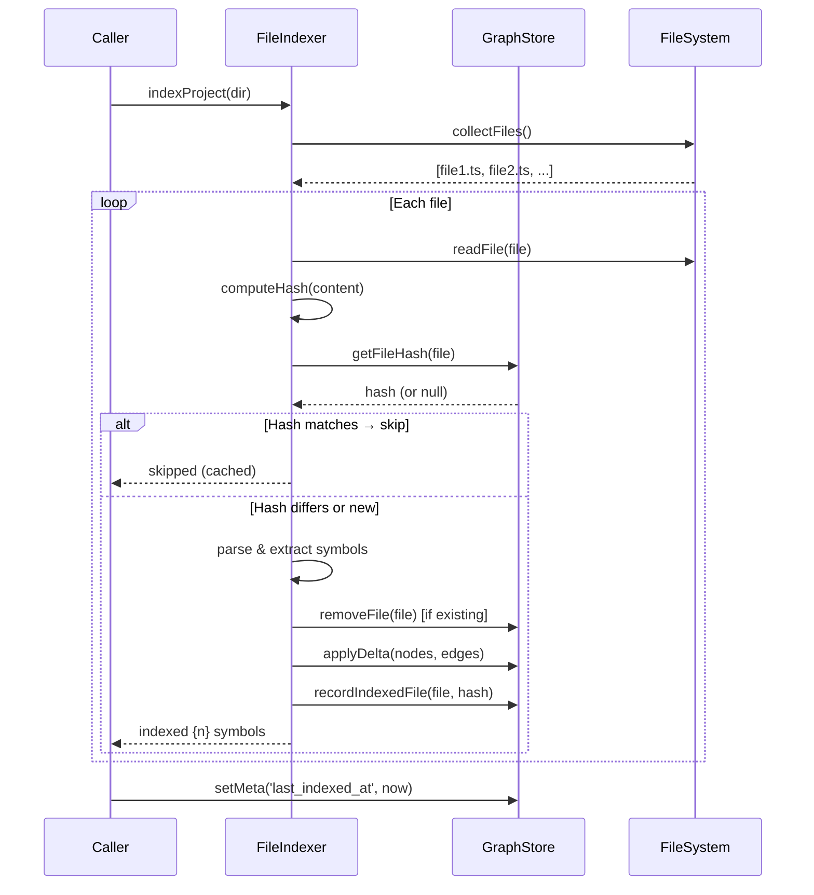

# RepoGraph Persistence Design

> Knowledge graph schema, persistence strategy, and incremental update plan for `@hermes/repograph`
>
> Status: Design Proposal · Date: 2026-05-27 · Author: Spectra

---

## 1. Problem Statement

The current `GraphEngine` is purely in-memory. Every server restart requires a full re-index of the project directory. For a mid-size project (thousands of files, tens of thousands of symbols) this means:

- 10–60s of cold start every time the MCP server launches
- Lost graph state if the process crashes
- No way to share graph state across multiple MCP server instances
- No delta-update mechanism — every index operation is additive-only with no invalidation

The intent store already has persistence (SQLite via `better-sqlite3`). The graph itself needs the same treatment.

---

## 2. Storage Format: SQLite

SQLite is the obvious choice:

| Criterion | SQLite | JSON file | Custom binary |
|-----------|--------|-----------|---------------|
| Atomic writes | ✅ WAL mode | ❌ Rewrite whole file | ❌ |
| Incremental updates | ✅ INSERT/UPDATE/DELETE | ❌ | ✅ but custom |
| Concurrent reads | ✅ | ❌ | ❌ |
| FTS / querying | ✅ FTS5 | ❌ Linear scan | ❌ |
| Existing dep graph | ✅ `better-sqlite3` already used | ✅ no dep needed | ❌ |
| Portability | ✅ Single file | ✅ Single file | ❌ |
| Schema enforcement | ✅ CHECK/REFERENCES | ❌ Runtime only | ❌ |

The package already depends on `better-sqlite3`. The existing `DbInterface`/`JsonFileStore` pattern from `db.ts` provides a proven fallback strategy.

**Decision: SQLite with `better-sqlite3` primary, JSON fallback for environments where native modules can't compile.**

---

## 3. File Location

```
{project_root}/.code-inspect-mcp/knowledge_graph/
├── repograph.db          ← SQLite database
├── repograph.db-wal      ← SQLite WAL (auto)
├── repograph.db-shm      ← SQLite SHM (auto)
└── repograph.fallback.json  ← JSON fallback (if better-sqlite3 unavailable)
```

**Rationale:**
- `.code-inspect-mcp/` is the canonical Hermes data directory per the monorepo convention
- `knowledge_graph/` namespace isolates graph data from other tool state
- The `.gitignore`-friendly location means the graph is a local cache, not committed
- WAL/SHM files are auto-managed by SQLite

---

## 4. Schema Design

### 4.1. Entity-Relationship Diagram (textual)

```
┌──────────────────┐       ┌────────────────────────────────┐
│    graph_meta     │       │            nodes               │
├──────────────────┤       ├────────────────────────────────┤
│ PK key    TEXT    │       │ PK id           TEXT           │
│    value  TEXT    │       │    type         TEXT  [CK]     │
└──────────────────┘       │    label        TEXT           │
                           │    file_path    TEXT           │
┌──────────────────┐       │    metadata     TEXT  [JSON]   │
│  indexed_files    │       │    created_at   TEXT           │
├──────────────────┤       │    updated_at   TEXT           │
│ PK file_path TEXT │       └──────────┬─────────────────────┘
│    file_hash TEXT│                   │ 1
│    indexed_at TEXT│                  │
│    node_count INT│                  │ N
└──────────────────┘       ┌──────────┴─────────────────────┐
                           │            edges                │
                           ├────────────────────────────────┤
                           │ PK id           INTEGER (auto)  │
                           │ FK from_id      TEXT → nodes.id │
                           │ FK to_id        TEXT → nodes.id │
                           │    type         TEXT  [CK]      │
                           │    metadata     TEXT  [JSON]    │
                           │    created_at   TEXT            │
                           │ UNIQUE(from_id, to_id, type)    │
                           └────────────────────────────────┘
```

### 4.2. Core Tables

#### `nodes`

Stores graph nodes — files, classes, functions, interfaces, types, variables, exports.

```sql
CREATE TABLE nodes (
  id        TEXT NOT NULL PRIMARY KEY,
  type      TEXT NOT NULL CHECK (type IN (
               'file', 'class', 'function', 'interface',
               'type', 'variable', 'export'
             )),
  label     TEXT NOT NULL,
  file_path TEXT NOT NULL,
  metadata  TEXT,  -- JSON blob for extensible properties
  created_at TEXT NOT NULL DEFAULT (datetime('now')),
  updated_at TEXT NOT NULL DEFAULT (datetime('now'))
);

CREATE INDEX idx_nodes_file_path ON nodes(file_path);
CREATE INDEX idx_nodes_type     ON nodes(type);

-- FTS5 virtual table for full-text search on node labels/ids
CREATE VIRTUAL TABLE nodes_fts USING fts5(
  id UNINDEXED,
  label,
  content='nodes',
  content_rowid='rowid'
);
```

**Node ID convention** (inherited from `GraphEngine.nodeId()`):
- Files: `file:<relative/path/to/file.ts>`
- Symbols: `sym:<name>@<relative/path/to/file.ts>`

#### `edges`

Directed relationships between nodes.

```sql
CREATE TABLE edges (
  id        INTEGER NOT NULL PRIMARY KEY AUTOINCREMENT,
  from_id   TEXT NOT NULL REFERENCES nodes(id) ON DELETE CASCADE,
  to_id     TEXT NOT NULL REFERENCES nodes(id) ON DELETE CASCADE,
  type      TEXT NOT NULL CHECK (type IN (
               'defines', 'imports', 'calls', 'extends', 'implements'
             )),
  metadata  TEXT,  -- JSON blob (e.g., { "names": ["Foo"], "default": true })
  created_at TEXT NOT NULL DEFAULT (datetime('now')),
  UNIQUE(from_id, to_id, type)
);

CREATE INDEX idx_edges_from   ON edges(from_id);
CREATE INDEX idx_edges_to     ON edges(to_id);
CREATE INDEX idx_edges_type   ON edges(type);
```

#### `graph_meta`

Key-value store for graph-level metadata.

```sql
CREATE TABLE graph_meta (
  key   TEXT NOT NULL PRIMARY KEY,
  value TEXT NOT NULL
);
```

| Key | Value example | Purpose |
|-----|--------------|---------|
| `schema_version` | `"1"` | Schema migration tracking |
| `last_indexed_at` | `"2026-05-27T22:30:00Z"` | Timestamp of last full index |
| `indexed_file_count` | `"142"` | Number of files currently indexed |
| `root_directory` | `"/home/kerwin/code/hermes-mcp-toolset"` | Project root |
| `total_nodes` | `"3842"` | Running node count |
| `total_edges` | `"12751"` | Running edge count |

#### `indexed_files`

Tracks which files have been indexed and their content hashes for incremental updates.

```sql
CREATE TABLE indexed_files (
  file_path  TEXT NOT NULL PRIMARY KEY,
  file_hash  TEXT NOT NULL,  -- SHA-256 of file content at last index
  indexed_at TEXT NOT NULL DEFAULT (datetime('now')),
  node_count INTEGER NOT NULL DEFAULT 0
);
```

---

## 5. Graph Persistence API

### 5.1. Interface

```typescript
export interface GraphStore {
  /** Initialize the database (create tables, run migrations) */
  initialize(): void;

  // ── Node CRUD ──

  /** Insert a node. Returns true if new, false if already exists. */
  insertNode(node: GraphNode): boolean;

  /** Get a node by ID. */
  getNode(id: string): GraphNode | undefined;

  /** Get all nodes for a file path. */
  getNodesByFile(filePath: string): GraphNode[];

  /** Update a node's metadata. */
  updateNode(id: string, metadata: Record<string, unknown>): void;

  /** Delete a node and its edges. */
  deleteNode(id: string): void;

  // ── Edge CRUD ──

  /** Insert an edge. Returns the edge ID. */
  insertEdge(edge: GraphEdge): number;

  /** Get all edges. */
  getAllEdges(): GraphNode[];

  /** Get outgoing edges from a node. */
  getOutgoingEdges(nodeId: string): GraphEdge[];

  /** Get incoming edges to a node. */
  getIncomingEdges(nodeId: string): GraphEdge[];

  /** Delete all edges for a set of node IDs. */
  deleteEdgesForNodes(nodeIds: Set<string>): void;

  // ── Batch / Sync ──

  /** Bulk insert nodes and edges (transactional). */
  applyDelta(delta: { nodes: GraphNode[]; edges: GraphEdge[] }): void;

  /** Remove all nodes/edges for a given file (re-index preparation). */
  removeFile(filePath: string): void;

  /** Search nodes by label/ID (via FTS5). */
  searchNodes(query: string, limit?: number): GraphNode[];

  /** Get graph metadata. */
  getMeta(key: string): string | undefined;

  /** Set graph metadata. */
  setMeta(key: string, value: string): void;

  // ── File tracking ──

  /** Record a file as indexed. */
  recordIndexedFile(filePath: string, hash: string, nodeCount: number): void;

  /** Get the stored hash for a file. Returns null if not indexed. */
  getFileHash(filePath: string): string | null;

  /** Check if a file needs re-indexing. */
  needsReindex(filePath: string, currentHash: string): boolean;

  // ── Lifecycle ──

  /** Close the database connection. */
  close(): void;

  /** Drop all data and re-create tables (for full re-index). */
  clear(): void;
}
```

### 5.2. SQLiteStore Implementation (Outline)

```typescript
class SqliteGraphStore implements GraphStore {
  private db: Database;

  initialize(): void {
    this.db.pragma('journal_mode = WAL');
    this.db.pragma('foreign_keys = ON');

    this.db.exec(`
      CREATE TABLE IF NOT EXISTS graph_meta (...);
      CREATE TABLE IF NOT EXISTS nodes (...);
      CREATE TABLE IF NOT EXISTS edges (...);
      CREATE TABLE IF NOT EXISTS indexed_files (...);
      CREATE VIRTUAL TABLE IF NOT EXISTS nodes_fts USING fts5(...);
    `);

    // Run schema migrations based on graph_meta.schema_version
    this.migrate();
  }

  applyDelta(delta: { nodes: GraphNode[]; edges: GraphEdge[] }): void {
    const transaction = this.db.transaction(() => {
      for (const node of delta.nodes) {
        this.insertNode(node);
      }
      for (const edge of delta.edges) {
        this.insertEdge(edge);
      }
    });
    transaction();
  }

  removeFile(filePath: string): void {
    // 1. Find all nodes for this file
    // 2. Delete edges referencing those nodes
    // 3. Delete the nodes
    // 4. Remove from indexed_files
    this.db.transaction(() => {
      const nodes = this.getNodeIdsByFile(filePath);
      // ...DELETE edges WHERE from_id IN (...) OR to_id IN (...)
      // ...DELETE nodes WHERE file_path = ?
      // ...DELETE FROM indexed_files WHERE file_path = ?
    })();
  }
}
```

### 5.3. JSON Fallback Store

Same interface, same file location convention. Uses `repograph.fallback.json` instead of the SQLite file. Full-rewrite on every write. Suitable for environments where `better-sqlite3` cannot compile (certain Docker images, restricted CI runners).

Trade-offs accepted:
- No FTS (linear scan for search)
- No referential integrity
- Slower for large graphs
- Not suitable for concurrent access

---

## 6. Incremental Update Strategy

### 6.1. File-Level Delta Detection

The indexer already operates per-file. The key insight: **index a file, get its nodes/edges, diff against what's stored.**

```
Step 1: Index a file → { nodes, edges }
Step 2: Compute SHA-256 of file content
Step 3: Look up stored hash in indexed_files table
Step 4: If hash matches → skip (file unchanged)
Step 5: If hash differs →
  5a. Remove old nodes/edges for this file (transactional)
  5b. Insert new nodes/edges
  5c. Update indexed_files with new hash
Step 6: If file is new → add nodes/edges, record in indexed_files
```

### 6.2. Full Index Flow



### 6.3. Warmup Flow (Server Start)

```
1. Open repograph.db
2. Read graph_meta.last_indexed_at
3. If meta exists → graph is cached. Load nodes/edges count, ready.
4. If no meta → graph is empty. First index needed.
5. On first query that needs data → trigger index if stale.
```

The GraphEngine can be loaded from SQLite on startup:

```typescript
function loadEngineFromStore(store: GraphStore): GraphEngine {
  const engine = new GraphEngine();
  const nodes = store.getAllNodes();
  const edges = store.getAllEdges();
  for (const node of nodes) engine.addNode(node);
  for (const edge of edges) engine.addEdge(edge);
  return engine;
}
```

### 6.4. Staleness Check

The MCP server checks staleness on tool calls that depend on the graph:

| Tool | Staleness check |
|------|----------------|
| `repograph.query` | None — uses in-memory engine. If engine empty, load from store. |
| `repograph.index_file` | Hash-based: skip if hash unchanged. |
| `repograph.index_project` | Hash-based: skip unchanged files. |
| `repograph.find_references` | Same as query — uses engine. |
| `repograph.find_definitions` | Same — uses engine. |

No automatic background watcher in v1. File-watching (chokidar, fs.watch) is a future enhancement.

---

## 7. Schema Migration Strategy

`schema_version` in `graph_meta` drives migrations:

```typescript
private migrate(): void {
  const version = parseInt(this.getMeta('schema_version') ?? '0', 10);

  if (version < 1) {
    this.db.exec(`CREATE TABLE IF NOT EXISTS graph_meta (...)`);
    this.db.exec(`CREATE TABLE IF NOT EXISTS nodes (...)`);
    // ...etc
    this.setMeta('schema_version', '1');
  }

  // Future: if (version < 2) { ... alter table ... }
}
```

Each migration is a monotonic version bump with backward-compatible ALTER TABLE or data transforms.

---

## 8. GraphEngine Integration

The `GraphEngine` stays as the in-memory query layer. The store is a separate concern:

```
┌──────────────┐     load on start     ┌─────────────┐
│  GraphStore   │ ──────────────────→  │ GraphEngine │
│  (SQLite)     │                      │ (in-memory) │
│              │ ←── save on index ── │             │
└──────────────┘                      └─────────────┘
```

No need to query SQLite for every graph operation — the in-memory engine handles queries. SQLite is the durable cache.

**Change to GraphEngine:** None needed. It already has `getAllNodes()` and `getAllEdges()` for serialization. The store handles the I/O.

---

## 9. Change to Existing Files

| File | Change |
|------|--------|
| `src/graph-store.ts` | **NEW** — `GraphStore` interface + `SqliteGraphStore` + `JsonGraphStore` |
| `src/db.ts` | No change — this is for the intent store, separate concern |
| `src/file-indexer.ts` | Add `computeHash(content)` method. `applyToGraph` overload to also write to store. |
| `src/index.ts` (MCP server) | On startup: initialize `GraphStore`, load engine from store. On `index_project`: write through to store. |
| `src/graph-engine.ts` | Minor: add `toJSON()` / `fromJSON()` helpers, or leave as-is and let the store serialize directly. |
| `package.json` | Already has `better-sqlite3` — no new deps. |

---

## 10. Open Questions & Future Work

1. **File watching** — `chokidar` or native `fs.watch` for automatic re-index on file save. Out of scope for v1.
2. **Cross-session graph sharing** — If multiple MCP servers index the same project, WAL mode allows concurrent reads. Writes should be serialized at the application layer.
3. **Graph diff export** — For CI/CD pipelines: export graph changes as a diff between two snapshots.
4. **Garbage collection** — Stale nodes (orphaned by deleted files) are cleaned up by `removeFile()`. No full GC pass needed in v1.
5. **Large repos** — For repos with 50k+ files, consider lazy-loading: only load nodes for files in the current query scope.
6. **The `calls` edge type** — Currently defined in types but not emitted by the regex indexer. Tree-sitter integration (future) would populate this. The schema is ready for it.

---

## 11. Acceptance Criteria Checklist

- [x] **Clear schema diagram** — Section 4.1 with ER diagram
- [x] **Storage format specification** — Section 2 (SQLite) + Section 3 (file location)
- [x] **Plan for incremental updates** — Section 6 (file-level delta, hash-based staleness)
- [x] **New file: `src/graph-store.ts`** — Interface + implementations specified
- [x] **Minimal changes to existing code** — Section 9 tracks exact changes
- [x] **Fallback strategy** — JSON file store for environments without native modules
- [x] **Migration strategy** — Section 7
